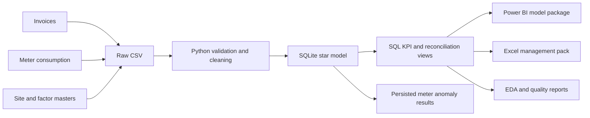
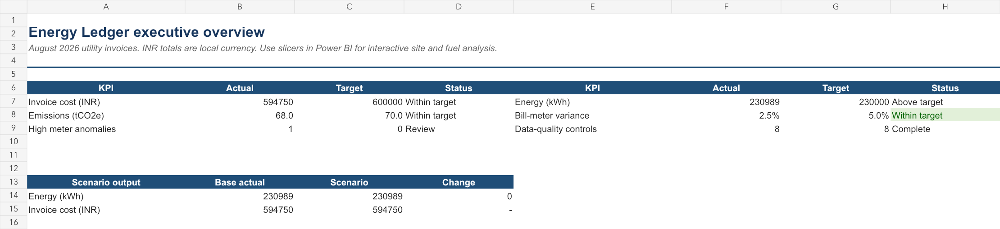
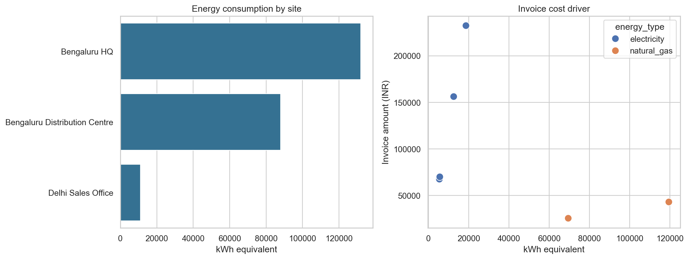
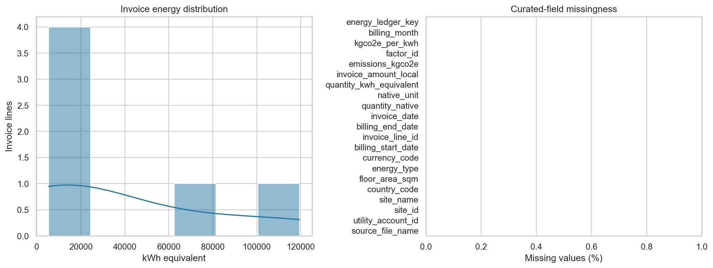

# Energy Ledger

Energy Ledger is an auditable energy-data reconciliation platform for Finance, Facilities, and Sustainability teams. It converts inconsistent utility invoices, monthly meter consumption, site master data, and emissions factors into a governed operating record with traceable cost, consumption, and emissions metrics.

## What it delivers

- A validated raw-to-curated pipeline that preserves source business keys and blocks invalid loads.
- A SQLite star schema with conformed site, date, energy type, currency, emissions-factor, and meter dimensions.
- Governed KPI, reconciliation, bill-to-meter variance, invoice-rate exception, and robust meter-anomaly views.
- Reproducible EDA figures, a management-ready Excel workbook, and Power BI import/DAX assets.

## Problem, stakeholders, and dataset

Utility data is split across invoices, meter portals, and reference workbooks with inconsistent keys, dates, fuel labels, units, and periods. This platform provides governed cleaning, a dimensional model, reconciliations, anomaly detection, SQL analytics, and decision products.

| Stakeholder | Decision supported |
| --- | --- |
| Finance | Is billed cost complete, reconciled, and suitable for close? |
| Facilities | Which site/account/meter interval needs investigation? |
| Sustainability | Is energy activity complete and traceable to an effective factor? |

The tracked data is a deliberately small **synthetic** India sample: six August 2026 invoice lines, three sites, two controlled factors, and 45 January–September meter intervals. It is safe to publish, includes real-world-format inconsistencies, and contains one deliberate meter anomaly. It is not operational or disclosure data.

## Architecture and data model



Invoice grain is one utility invoice line. Meter grain is one meter, closed billing interval, and source reading. Integer surrogate keys join conformed site, date, energy-type, currency, factor, and meter dimensions while source business keys remain visible for auditability.

## KPIs, controls, and techniques

| KPI / control | Implementation |
| --- | --- |
| Consumption, cost, emissions, intensity, cost/kWh | `v_monthly_site_energy_kpis`, `v_monthly_portfolio_trends` |
| Bill-versus-meter variance | Exact site/account/fuel/period matching; high above 5% |
| Meter anomaly | Trailing median/MAD robust-z score; high/low above absolute 3.5 after six prior periods |
| Reconciliation | Source → curated → reporting, 0-row and ₹0.01 value tolerance |
| Data quality | Required fields, duplicates, ranges, relationships, freshness, reconciliation |

The implementation uses Python `csv`/`Decimal`, SQLite foreign keys, SQL CTEs and `LAG`, Pandas/NumPy/Seaborn EDA, and Power BI-ready DAX/SQLite extracts. The Excel pack includes formula-driven scenario controls and editable charts.

## Screenshots

### Executive management summary



### Consumption and invoice-cost drivers



### Distribution and completeness



## Quick start

Requirements: Python 3 and the packages in `requirements.txt`.

```sh
git clone https://github.com/xvipull/energy-ledger.git
cd energy-ledger
python3 -m venv .venv
source .venv/bin/activate
pip install -r requirements.txt
python3 src/run_pipeline.py
python3 -m unittest discover -s tests -v
python3 src/run_eda.py
```

This generates the ignored SQLite database, clean staging CSVs, quality report, EDA report, and figures. The generated artifacts are reproducible from the tracked raw data and code. Verify reconciliation:

```sh
sqlite3 data/energy_ledger.db "SELECT * FROM v_reconciliation_source_to_reporting;"
```

Open [the Excel management pack](excel/energy_ledger_management_pack.xlsx) for management review. Use [the Power BI package](powerbi/README.md) to create the desktop report from governed SQLite extracts.

## Repository guide

| Path | Purpose |
| --- | --- |
| `data/raw/` | Synthetic invoices, meter readings, site master, and emissions factors |
| `src/pipeline.py` | Validation, cleaning, dimensional loading, and reconciliation orchestration |
| `sql/` | Star schema, KPI layer, reconciliation, and advanced-analytics SQL |
| `tests/` | Pipeline, control, reconciliation, and anomaly regression tests |
| `reports/` | Reproducible EDA summary and generated visual outputs |
| `excel/` | Management-pack workbook |
| `powerbi/` | SQLite import queries, DAX measures, and Power BI setup notes |
| `docs/` | Data dictionary, implementation detail, assumptions, UAT, and demo materials |

## Insights, recommendations, and limitations

- Source, curated, and reporting invoice totals reconcile: 6 rows and ₹594,750.00 at every layer.
- All five August bill-to-meter matches are within 5%; the largest is Bengaluru HQ electricity at 2.46%.
- The deliberate September Bengaluru HQ electricity reading is a high anomaly (robust z 96.32) and requires meter/read/operating-context validation, not automatic action.
- The sample has one invoice month, synthetic values, no tariff/FX layer, no effective-dated meter mapping, and no weather/occupancy normalization. Expand history before operational trend conclusions.

Next steps: production source onboarding and volume testing, Finance approval of tax/credit/FX policy, effective-dated meter mappings, weather/occupancy enrichment, Power BI row-level security, and governed exception assignment.

## Portfolio impact statements

- Built a reproducible utility-data pipeline that standardizes mixed formats and blocks invalid loads.
- Implemented star-schema analytics, raw-to-reporting reconciliation, and robust meter anomaly detection with auditable thresholds.
- Delivered Power BI-ready semantic assets and an Excel management pack for Finance, Facilities, and Sustainability.

## Documentation

- [Data pipeline](docs/data_pipeline.md), [SQL analytics](docs/sql_analytics.md), [advanced analytics](docs/advanced_analytics.md), and [data dictionary](docs/data_dictionary.md)
- [UAT evidence](docs/uat.md), [demo script](docs/demo_script.md), [KPI catalog](docs/kpi_catalog.md), [assumptions](docs/assumptions.md), and [requirements](docs/requirements.md)
